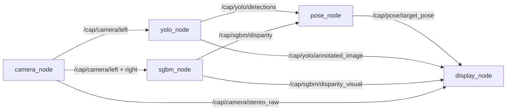

# CAP ROS2 工作区

这个目录是原项目之外的独立 ROS2 工作区，不改动 `cap2` 下的源文件。它把原有单进程流程拆成 5 个可独立运行的 ROS2 节点：

1. `camera_node`：读取双目相机并分发左右校正画面。
2. `sgbm_node`：SGBM 立体匹配，发布视差图。
3. `yolo_node`：YOLO 检测，发布检测框和标注图。
4. `pose_node`：结合检测框和视差解算目标 3D 位姿，并转换到机器人绝对坐标。
5. `display_node`：OpenCV 窗口显示标注图、深度图和原始双目图。

## 架构



## 目录

```text
cap_ros2/
  src/
    cap_ros2_interfaces/   # 自定义 msg / srv
    cap_ros2/              # 5 个 Python 节点 + launch + config
  scripts/
    install_jetson.sh      # Jetson 安装依赖并 colcon build
    setup_links.sh         # 可选：链接原项目 weights/outcome/staticSource
    run.sh                 # 一键启动
```

## 在 Jetson 上构建

```bash
cd cap_ros2
bash scripts/setup_links.sh
bash scripts/install_jetson.sh
source install/setup.bash
```

如果原项目的 `weights/pjhdBG.engine` 在别的路径，也可以不建链接，启动时显式传：

```bash
ros2 launch cap_ros2 cap_pipeline.launch.py \
  model_path:=/绝对路径/pjhdBG.engine
```

如果只把 `cap_ros2` 拷贝到新 Jetson，请把权重文件放到 `cap_ros2/weights/` 下，或用上面的 `model_path` 指向实际位置。

## 启动

```bash
source /opt/ros/humble/setup.bash
source cap_ros2/install/setup.bash
ros2 launch cap_ros2 cap_pipeline.launch.py
```

默认 `camera_node` 直接打开 `/dev/video0`。如果仍然使用原项目的 `camera_server` 写入 `/dev/video2`，请改为：

```bash
ros2 launch cap_ros2 cap_pipeline.launch.py camera_id:=2

# 也可以只单独运行相机节点：
ros2 run cap_ros2 camera_node --ros-args -p camera_id:=2
```

无桌面环境时只跑算法、不弹窗口：

```bash
ros2 launch cap_ros2 cap_pipeline.launch.py use_display:=false
```

只启动单个节点：

```bash
ros2 run cap_ros2 camera_node --ros-args -p camera_id:=0
ros2 run cap_ros2 yolo_node --ros-args -p model_path:=/path/to/pjhdBG.engine
```

## 话题

| 话题 | 类型 | 发布者 | 说明 |
| --- | --- | --- | --- |
| `/cap/camera/left` | `sensor_msgs/CompressedImage` | camera | 校正后的左目 JPEG |
| `/cap/camera/right` | `sensor_msgs/CompressedImage` | camera | 校正后的右目 JPEG |
| `/cap/camera/stereo_raw` | `sensor_msgs/CompressedImage` | camera | 原始双目拼图 |
| `/cap/yolo/detections` | `cap_ros2_interfaces/DetectionArray` | yolo | 检测框数组 |
| `/cap/yolo/annotated_image` | `sensor_msgs/CompressedImage` | yolo | YOLO 标注图 |
| `/cap/sgbm/disparity` | `sensor_msgs/Image` | sgbm | 32FC1 视差，单位像素 |
| `/cap/sgbm/disparity_visual` | `sensor_msgs/CompressedImage` | sgbm | 伪彩色视差图 |
| `/cap/pose/target_pose` | `cap_ros2_interfaces/TargetPose` | pose | 目标 3D 位姿，单位 mm/deg |

## 服务

| 服务 | 类型 | 说明 |
| --- | --- | --- |
| `/cap/camera/enable` | `std_srvs/SetBool` | 暂停/恢复相机发布 |
| `/cap/camera/capture` | `std_srvs/Trigger` | 保存当前左右校正图和原始拼图 |
| `/cap/yolo/enable` | `std_srvs/SetBool` | 暂停/恢复 YOLO 检测 |
| `/cap/yolo/reload` | `std_srvs/Trigger` | 重新加载 YOLO 模型 |
| `/cap/sgbm/enable` | `std_srvs/SetBool` | 暂停/恢复 SGBM |
| `/cap/pose/get_target_pose` | `cap_ros2_interfaces/GetTargetPose` | 查询最近一次目标位姿 |

查询位姿示例：

```bash
ros2 service call /cap/pose/get_target_pose cap_ros2_interfaces/srv/GetTargetPose "{}"
ros2 topic echo /cap/pose/target_pose
```

## 多机通讯

ROS2 默认 DDS 使用同网段多播发现。若 Jetson 算法机和显示机不在同一机器，设置相同的 `ROS_DOMAIN_ID`，并确保两台设备在同一局域网：

```bash
export ROS_DOMAIN_ID=1
export ROS_LOCALHOST_ONLY=0
```

显示机可以只运行：

```bash
ros2 run cap_ros2 display_node
```

## 配置

`src/cap_ros2/config/` 下的 YAML 是原项目配置的独立副本：

- `capture.yaml`：相机输入源、设备号、fps。
- `camera_params.yaml`：双目内参、外参。
- `camera_setup.yaml`：相机在机器人上的安装位姿。
- `SGBM_params.yaml`：SGBM 参数和深度修正系数。
- `yolo_params.yaml`：YOLO 权重名、置信度、设备。
- `class_map.yaml`：蓝灯/绿灯类别 ID，用于 Roll 解算。

如果修改了原项目配置，需要同步这里的副本，或把 `config` 目录换成符号链接。
